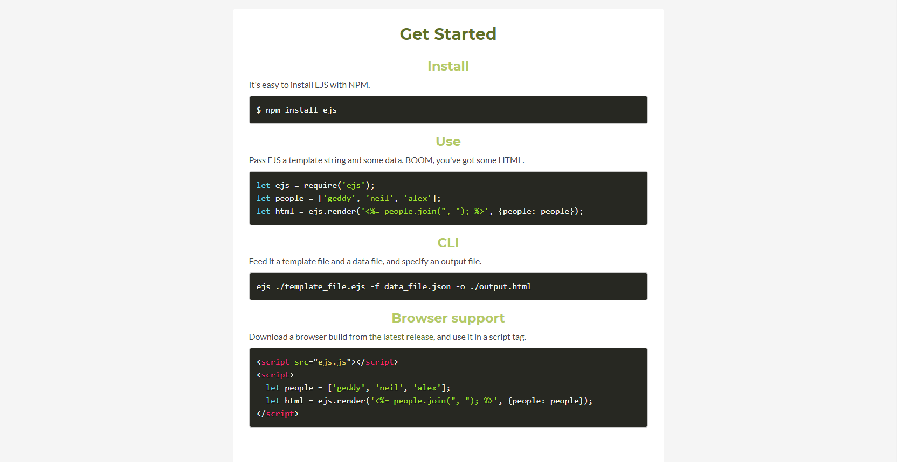

# EJS

## What is EJS ..

- EJS is a simple templating language that lets you generate HTML markup with plain JavaScript. No religiousness about how to organize things. No reinvention of iteration and control-flow. It's just plain JavaScript.

## Why do we use EJS? 

- It is a simple templating language/engine that lets its user generate HTML with plain javascript. EJS is mostly useful whenever you have to output HTML with a lot of javascript.

